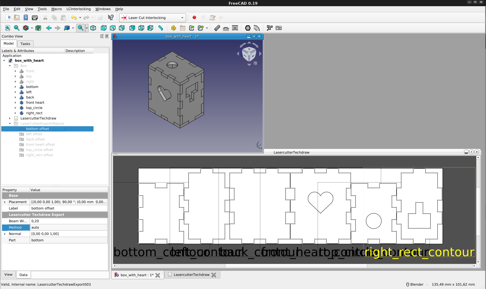

#  FreeCAD Lasercutter SVG Export Macro

This tool is derived from the macro [LasercutterSVGExport](https://forum.freecadweb.org/viewtopic.php?f=35&t=31869)  

Do not add the laserbeam width into your design. This export tool will add the beam width.

* Select several parts in the FreeCAD design
* Creates outline objects from all selected items
* Rotate them into the XY-plane
* Create views in a TechDraw page
* Arrange the views to fit in the page with minimal gaps

The tool creates a folder LaserCutterExportObjects that contains an object for each selected part.  
There are some parametes which can be changed:
* Part: Selected part
* Beam Width: The width of the laser beam in mm
* Normal: A vector perpendicular to the object
* Method: How to create the outline 
    *auto*: find the best method automatically 
    *2D*: works for 2D objects
    *3D*: create a 3D outline and then get the biggest face
    *face*: find the biggest face and create a 2D offset

## Troubleshooting
Find your part in the folder LaserCutterExportObjects and play with the parameters.  

*Got the wrong side of your part:*  
Change the parameter Normal to be perpendicular to the wanted side
  
*Missing lines or no view at all in Techdraw:*  
Change the parameter method. Try out different settings.

