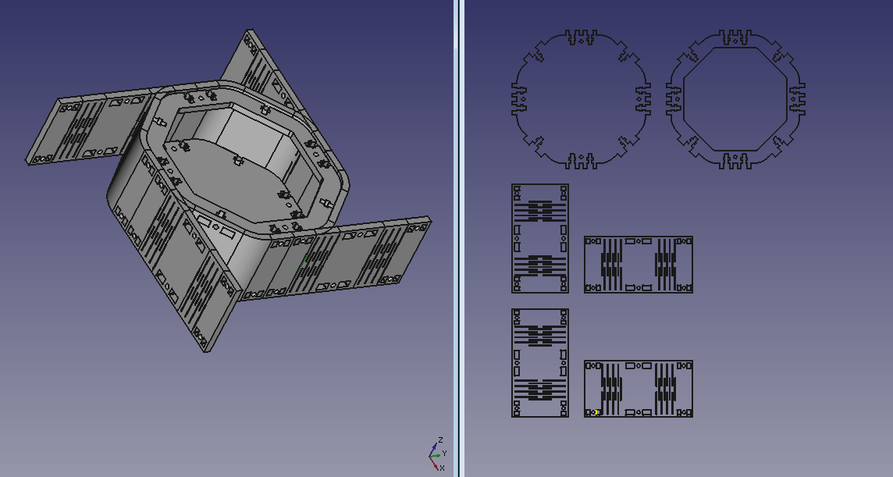
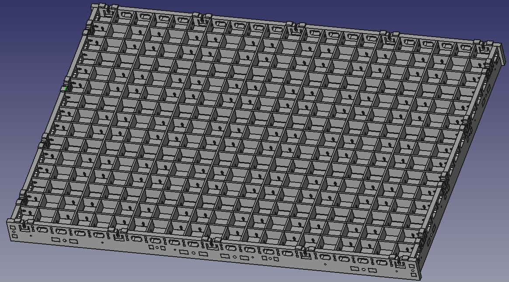

# LCInterlocking - FreeCAD Laser Cut Interlocking Module


## Goal
This experimental FreeCAD module is used to create interlocking cut parts from 3D to 2D SVG. 
It was created for laser cutting but can work with CNC router.  

**Important Note:**  
**This is still experimental and as a consequence, not reliable. You must check parts before doing the laser cut.**  
**Please double check the results of this module!**

## Panel
This panel appears when "Laser cut Interlocking" module is selected:


## Tools

 *  [Generate box without connection.](docs/box_generator.md)
 *  [Create tabs/slots connection.](docs/interlocking.md) (Interlocking tool)
 *  [Create node for cross connection.](docs/crosspiece.md) (Crosspiece tool)
 *  [Generate rounded box without connection.](docs/rounded_box_generator.md)
 *  [Create bend surface with living hinges.](docs/living_hinges.md)
 *  [Project parts to 2D plan in order to export in SVG format.](docs/export.md) (Export tool)

## Installation

### Recommended Install
[](https://github.com/FreeCAD/FreeCAD-addons)

Install this Addon via the builtin [FreeCAD Addon Manager](https://github.com/FreeCAD/FreeCAD-addons#1-builtin-addon-manager).  
1. Locate LCInterlocking in the Addon Manager
2. Install
3. Restart FreeCAD  
**Result**: 'Laser cut Interlocking' will be available via the workbench dropdown menu.

### Manual Install
<details>
<summary><i>Expand this to read more about manual installation of LCInterlocking FreeCAD Addon</i></summary>
  
1. Download the repository as zip via the Github interface or use `git` to clone the repo via the command line using:  
```bash
  git clone https://github.com/execuc/LCInterlocking .
```
2. After the download completes, the module must be moved to the `Mod` subfolder of the Freecad install directory.  
On Ubuntu 16.04 move the module to `/usr/share/freecad-daily/Mod/`  
In Windows it will probably be something like `C:\Program Files\FreeCAD\Mod`  
On Debian 9, the Mod directory is in `~/.FreeCAD/Mod/`

3. Restart Freecad and the LCInterlocking module should be detected.
</details>

## Troubleshooting Tip
It is advisable to show the FreeCAD report view and to redirect the python errors to show module warning/error.

## Feedback
If you encounter a bug please participate in the [dedicated FreeCAD discussion thread](https://forum.freecadweb.org/viewtopic.php?f=8&t=41196) and open a ticket in this repo's issue queue.

## Some videos previous versions
 * Box generator/interlocking/inkscape: https://youtu.be/YGFIdLpdWXE
 * Box tool: https://www.youtube.com/watch?v=wuu_lRsXGd0
 * Rounded box tool:  https://www.youtube.com/watch?v=lEOgZ6k9Vxw
 * Crosspiece: https://www.youtube.com/watch?v=tIchogx5BLE
 * Rounded corner: https://www.youtube.com/watch?v=KSnMxqjA_-Q
 
## Changelog
**v1.4: In progress**
 * Fix for FreeCAD 0.19.

**v1.3:**
 * Fix tab link widget not displayed.

**v1.2:**
 * Fix float entry max value(99.99) bug.
 
**v1.1:**
 * Restore crosspiece dog bones and node options.
 * Add fast preview option for interlocking tool.

**v1.0:**
 * Add a preview button to interlocking and crosspiece tool.
 * All tools can now be reedited.
 * Add support to Python 3 of Freecad 0.18.
 
## Gallery
  


## License
LGPL v2.1
