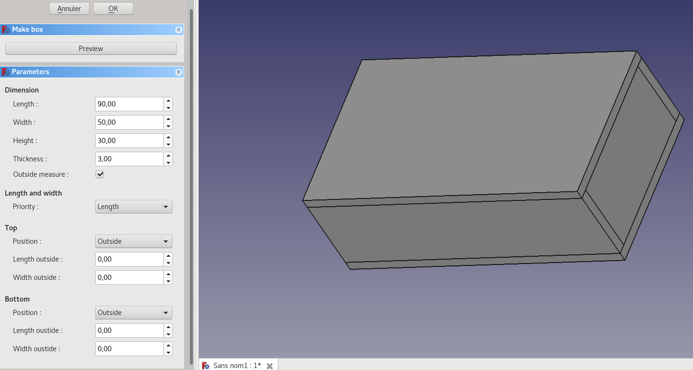

Box generator
===========

This tool allows to generate parts for making a box without no connection. 
It is just a convenient tool because same parts can be created from FreeCAD part/partDesign. User does not have to start with this to use the interlocking tool

 
Parameters
--------
 * Length/Width/Height: dimension of the box.
 * Thickness: thickness of the generated parts (ie: 3.0mm).
 * Outside measure: true if filled dimensions concerns box outside (inside + material thickness) or false if it is for inside.
 * Length and width priority:
    * Length/width
    * No-Cross: to prepare side panels for creating crosspiece parts (for crosspiece tool).
    * No-For rounding: to prepare side panels for creating rounded corners (for living hinges tool).
 * Top/Bottom:
    * Position: Inside or above/below box.
    * Outside dimensions if position is outside.

Preview button allow to take into account modified parameters whitout exiting edit mode.

Output
--------

Clicking OK, will create a group "Box" with six parts corresponding to 4 sides, the top and the bottom of the box.
User can re-edit box parameters double-clicking on "Box" group.

After, user can create tabs/slots with interlocking tools.

