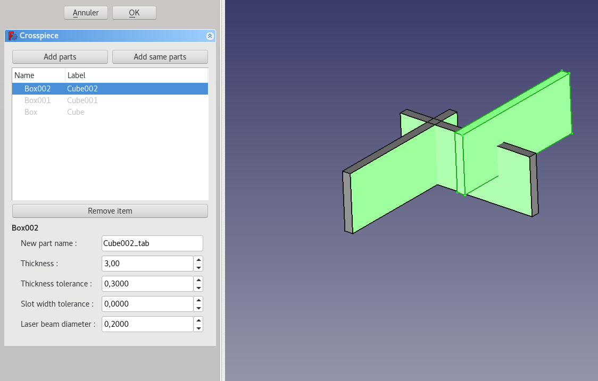
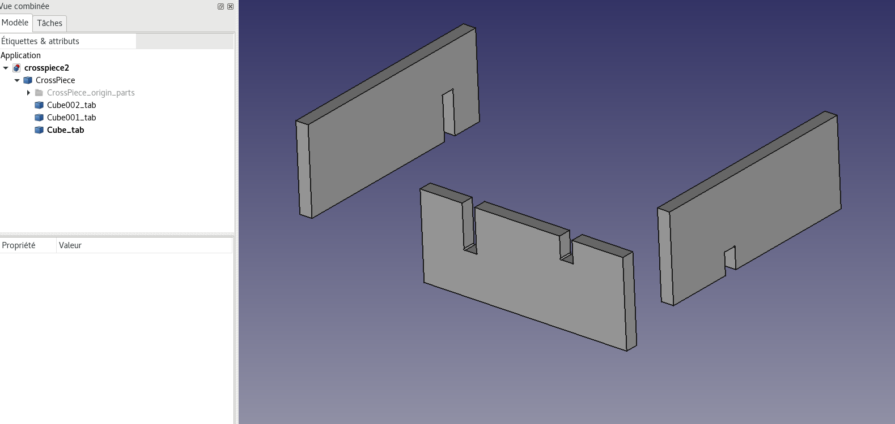

Crosspiece
===========

This tool allow to create slot on parts in order to fit together.

Procedure
-----------
 * Select all the involved part and click on "Add same parts" if they share the same material properties, else click on "Add parts"
 
 * Configure material properties on black font item from the tree view as thickness, laser cut beam diameter....
 * Click on OK to create a "Crosspiece" group. Interlocking parts are below this group. Origin parts are represented inside a sub group.
 
  
 Additional Information
----------------------------
  * Crosspiece properties can be edited again clicking on "Crosspiece" group item.
  * In editing mode, parts can be visualized by selecting the treview of the tools. Then they can be displayed/hidden by tapping in the key "space".
  * Preview button allows to create a new document with crosspiece parts without exiting tool. It's convenient to adjust connection parameters.

  
