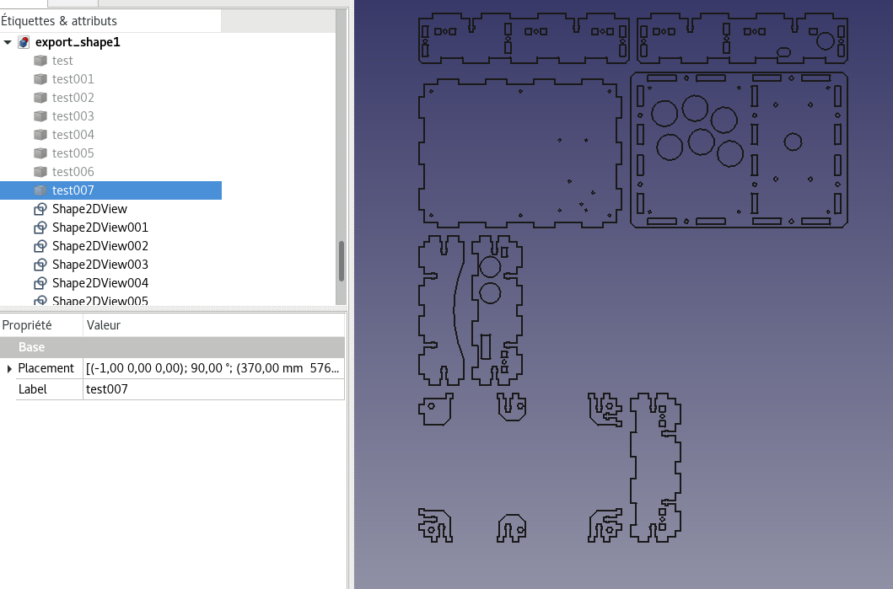

Export 
===========

 

Once the connections have been created, parts can be exported to SVG.
Parts have to be selected before clicking to this feature. A new document is created with copied parts and projections on XY plan. Select projections and export it to the Flattened SVG format. 

You can use inkscape to remove some unwanted lines (if exist) as line between tab and its parts. To do it, ungroup all, object to path, remove unwanted lines, join curves with very little tolerance and you can regroup all if you want.

Some details are not correctly drawn with Inkscape (i.e. "circle) in contrary to Corel Draw for example.

Note : 

 * Thanks to arkhnchul, ".removeSplitter()" method is used on shape to remove these unwanted lines. If it leads to error,
remove this call in exportPanel.py.

 * The export / inkscape step can be seen on at the end of a video about an older version of the module (https://youtu.be/YGFIdLpdWXE).

**Note (2019-05-21) :**
Some elements of projected parts have problems. For example, a circle may be displayed and exported 
in flatten SVG as hexagon. 
A workaround is to export in Autodesk DXF 2D (.dxf) format. It may be imported as inkscape but elements
can not be ungrouped. To do it, dxf file has to be opened in librecad, then select all (Ctrl+a) and click on Tools ->
Modify -> explode. Save file and re-import with inkscape. Now each segments and curves can be edited.  
