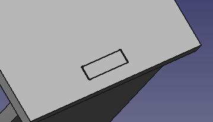
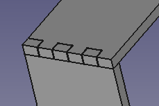
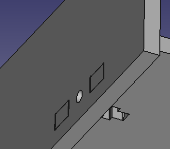
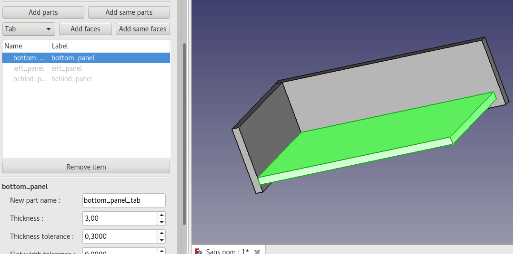
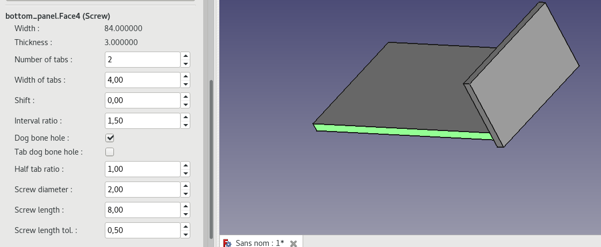
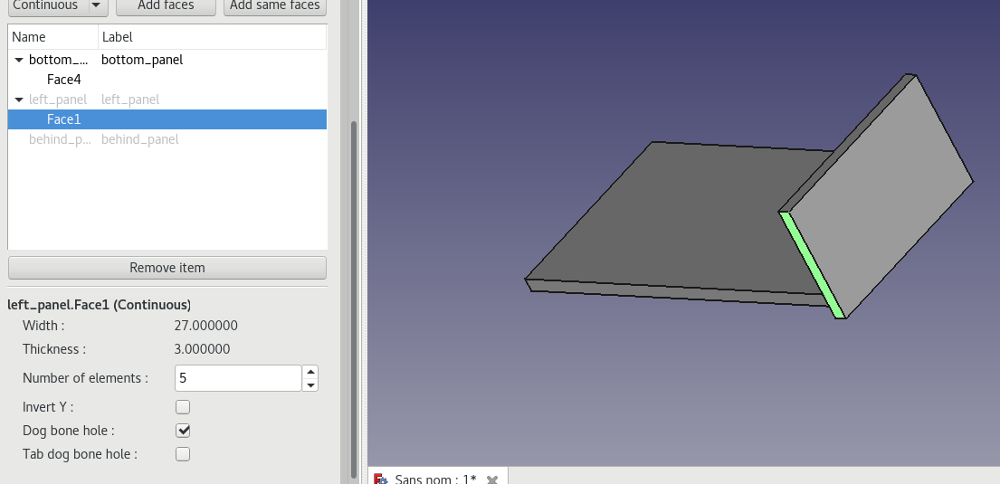
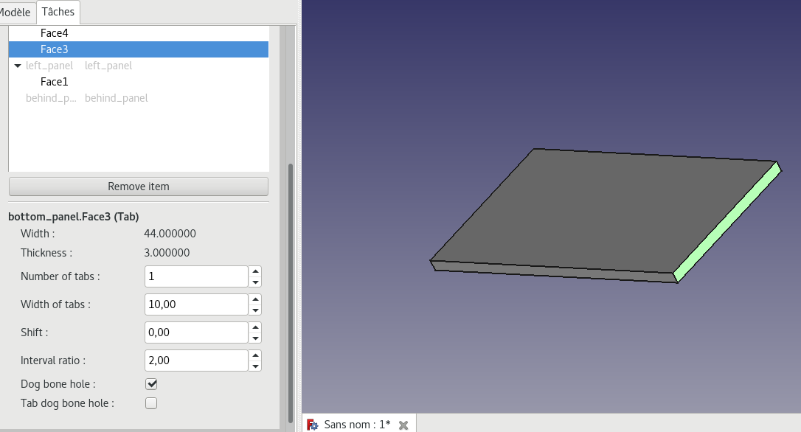
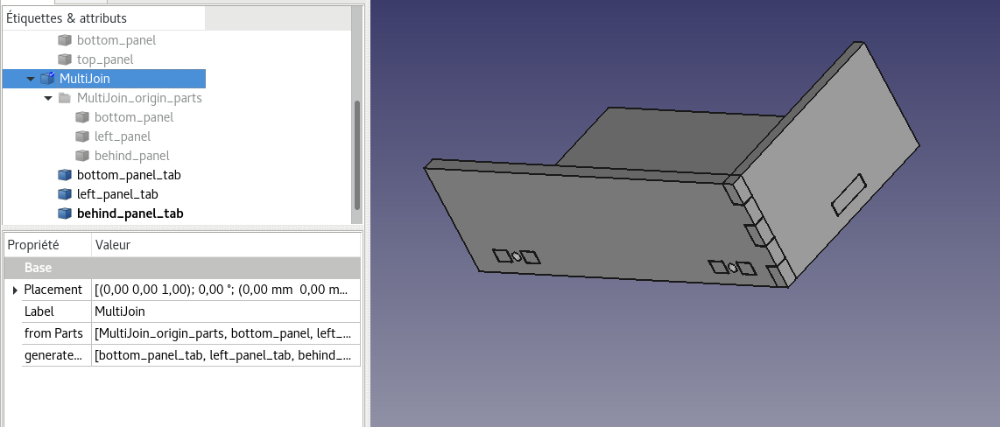

Interlocking
===========

This is the main tool of the LCInterlocking module. It allows to define connections between parts to create tabs and slots.

Parts can come from the Freecad Part/Part Design workshops or from the box generator tool of this module for example. To create a connection, the faces must stick.

There are three type of connections : tab, continuous tab and screw.  
  
  
 

Procedure
-------------
For this example, we start from parts generated from Box generator tool to make an 3mm thickness box. We remove three panels to simplify example.

 * Click on Interlocking tool to create a "MultiJoin" group in the treeview and go to edit mode.
 * All involved parts have to be defined in tool. Select all the parts and click on "Add same parts". All parts share the same material properties and appear as items in the treeview. Gray items means they are linked to the black item. Parts can be added with "Add part" but they will have different material properties.  
  
  * Specify material properties:
    * Name of the generated part
    * Thickness and tolerance of the material
    * Slot width tolerance: add tolerance on slot
    * Laser beam diameter: diameter of the material destroyed by the laser.
  * Hide the longest side panel (select from the tool list view and use space key)
  * Select the lateral face of the bottom part, select screw in the list instead of tab.
  * Click on "Add same faces" and adjust parameters as number of tabs, screw dimensions... 
  
  
  
  * Select the lateral face of the short side and choose "Tab" in the list.
  * Click on "Add same faces" or "Add faces" and adjust parameters 
  

  * With the same method, create a "tab" connection between the bottom and the short side. 
  
  
 
  * Click on OK to create a "MultiJoin" group. Origin parts are represented inside a "MultiJoin_origin_parts" group. Interlocking parts are below this group. 
   
   
  
 
Now, parts can be exported via the "Export tool" in order to obtain a 2D file (SVG).
  
Additional Information
----------------------------
  * Interlocking properties can be edited again clicking on "MultiJoin" group item.
  * In editing mode, parts and faces can can be visualized by selecting the in the treview of the tools. Then they can be displayed/hidden by tapping in the key "space".
  * Preview button allow to create a new document with interlocking parts without exiting tool. It's convenient to adjust connection parameters.
  * "Add same faces" works as "Add same parts", faces while share the same connection properties. 
  
