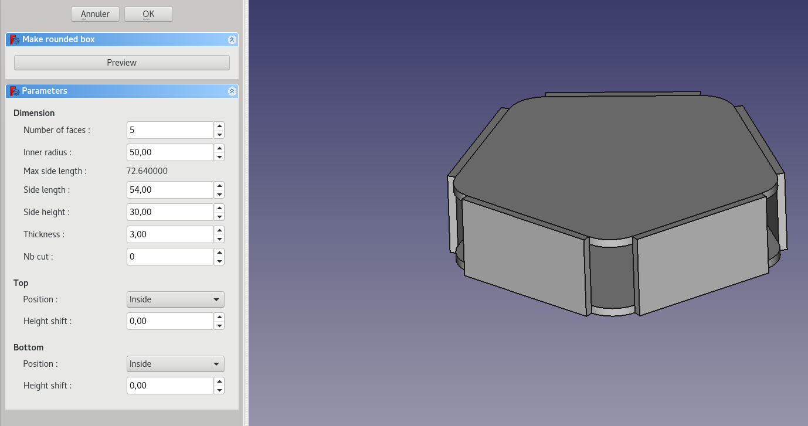
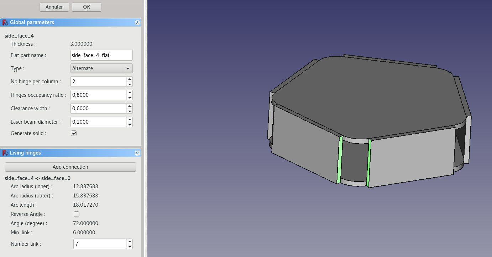
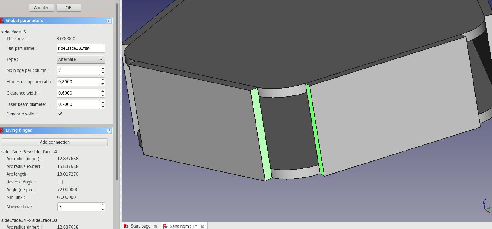
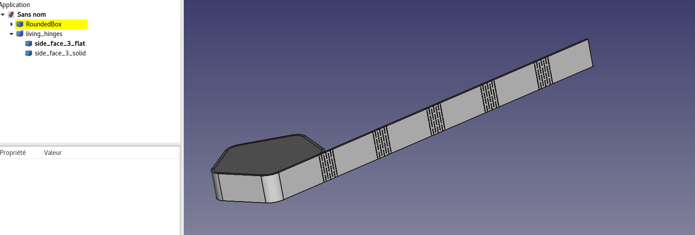

## Living hinges

This tool is used to make curved laser bend surface. Faces of oriented part which follow are flattened and linked with living hinges. Actually curved part must have its radius center equidistant from faces.

### Procedure

For the example we will start from a rounded box created from the corresponding tool:

 

 * Select the right face of the first part and then the left face of the second and click on "Add connection"

 

 * Select the right face of the second and then the left face of the third and "Add connection". Continue with all corners you want in the same order of selection.

 

 * Adjust parameters and click 'OK'. A "living_hinges" group is created with the flattened part and part with solid corner (for visualization). The flattened part can be exported via the export tool.

 

#### Note:

 * Properties can be edited again by clicking on the group.
 * In this example, first part will be added twice because it is referenced as first and as last item in connections. To make it work, first part has to be cut in two parts. Rounded box generator can do it with `NB cut` parameter to >= 1.
