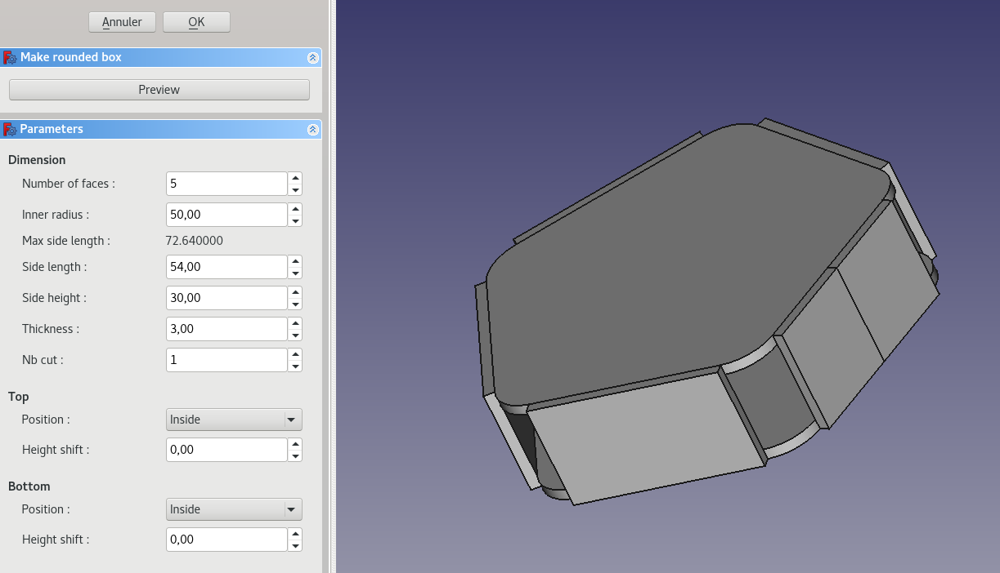

Rounded box generator
===========

This tool allows to generate parts (with no connection) for a rounded box. 
It is just a convenient tool because same parts can be created from FreeCAD part/partDesign. User does not have to start with this to use the interlocking/crosspieces/living hinges tools.

Parameters
--------
 * Number of faces/Inner radius : form and size of the box.
 * Max side length (read only): max allowed value for side length parameter.
 * Side length/height: panel side length and height
 * Thickness: thickness of the generated parts (ie: 3.0mm).
 * Nb cut: number of panel side that will be cut to their half (useful to divide the final side part in living hinges tool).
 * Top/Bottom
      * Inside: make panel inside with allowed height shift.
      * Outside: make panel outside with radius overtake to make cap/base).
    
Preview button allow to take into account modified parameters whitout exiting edit mode.

Output
--------

Clicking OK, will create a group "RoundedBox" with parts corresponding to the rounded box skeleton.
User can re-edit box parameters double-clicking on "RadiusBox" group.

After, user can create tabs/slots with interlocking tools and rounded corner with living hinges tools.

